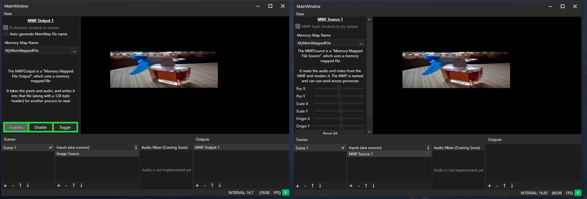

# FrameControlEx
A 2nd version of FrameControl. CBA to fix the old one so i'm remaking it :-)

I primarily made this app with the intent of it being able to send video/audio data to OBS, but making an OBS plugin 
is apparently literally impossible unless you know everything about CMake. So for now, it's just a app that can do pixel 
stuff and send frames to the same or other instances of frame control

## Preview
This shows 2 separate instances of the app running; the left has an image source that's stretching then drawing that image 
into the canvas, then that frame is sent to the MMF Output (memory mapped file output)

The 2nd instance then reads the frame from that memory mapped file, and draws it like a regular image

The visible view port is drawn after the frame is passed to each output. Soon may add a feature to disable the view port rendering, although it would barely 
help the performance because the frame (which is just a bitmap pretty much) is already fully rendered, and just needs to be drawn onto the UI

The left panel is what allows you to edit the selected scene, source or output. I was planning on using a window instead, but it would take a lot longer to implement a sort of "snapshot" view model of the specific things along with copying the same window boilerplate stuff over and over again, so the panel is just generally easier to implement

You can close the left and bottom panels by dragging them to the very left/bottom or double clicking the splitter (just like ableton live)
