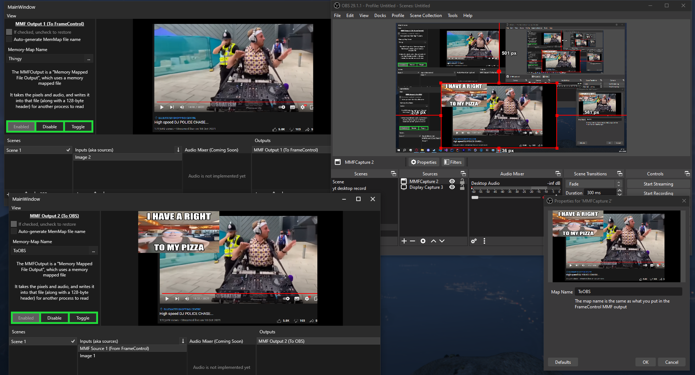

# FrameControlEx
A 2nd version of FrameControl. CBA to fix the old one so i'm remaking it :-)

I primarily made this app with the intent of it being able to send video/audio data to OBS, but making an OBS plugin 
is apparently literally impossible unless you know everything about CMake. So for now, it's just a app that can do pixel 
stuff and send frames to the same or other instances of frame control

## Preview
This shows 2 separate instances of the app running and OBS capturing from the last instance. The top-left only has 1 image source being the DJ guy (forgot his name :< ). That instance then writes the video to the memory mapped file called "Thingy". That is received by the bottom-left, the karen meme is added, and then that video is written to the memory mapped file called "ToOBS". Then, OBS receives it through a custom plugin I made (https://github.com/AngryCarrot789/framecontrol-obsmmf) and is displaying it in the bottom-middle
The 2nd instance then reads the frame from that memory mapped file, and draws it like a regular image

The visible view port in frame control is drawn after the frame is passed to each output (meaning if outputs were to modify
the video output which they shouldn't, it should be visible to the next outputs and view port).
Soon may add a feature to disable the view port rendering, although it would barely help the performance because 
the frame (which is just a bitmap prettymuch) is already fully rendered, and just needs to be drawn onto the UI

The left panel is what allows you to edit the selected scene, source or output. I was planning on using a window instead, but it would take a lot longer to implement a sort of "snapshot" view model of the specific things along with copying the same window boilerplate stuff over and over again, so the panel is just generally easier to implement

You can close the left and bottom panels by dragging them to the very left/bottom or double clicking the splitter (just like ableton live)
